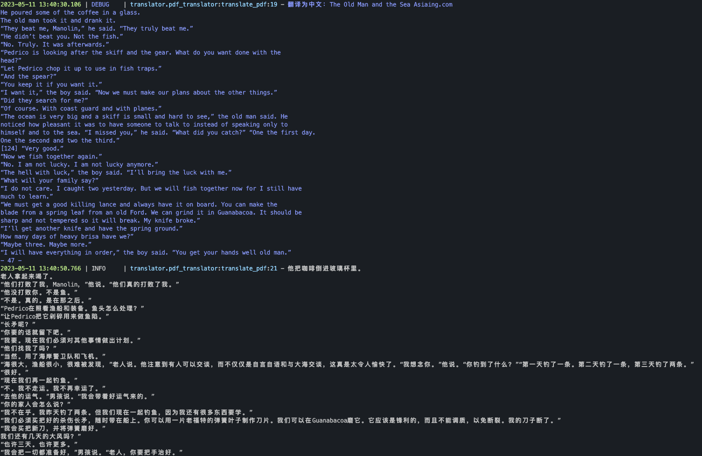

<!--
 * @Author: error: error: git config user.name & please set dead value or install git && error: git config user.email & please set dead value or install git & please set dead value or install git
 * @Date: 2024-03-23 20:47:09
 * @LastEditors: error: error: git config user.name & please set dead value or install git && error: git config user.email & please set dead value or install git & please set dead value or install git
 * @LastEditTime: 2024-03-24 11:45:01
 * @FilePath: \ai_translator\README.md
 * @Description: 这是默认设置,请设置`customMade`, 打开koroFileHeader查看配置 进行设置: https://github.com/OBKoro1/koro1FileHeader/wiki/%E9%85%8D%E7%BD%AE
-->
# ai_translator
AI翻译应用练习


## 开始使用

### 环境准备

1.克隆仓库 `git clone git@github.com:DjangoPeng/openai-translator.git`。

2.OpenAI-翻译器 需要 Python 3.6 或更高版本。使用 `pip install -r requirements.txt` 安装依赖项。

3.设置您的 OpenAI API 密钥(`$OPENAI_API_KEY`)或 ChatGLM 模型 URL(`$GLM_MODEL_URL`)。您可以将其添加到环境变量中，或者在 config.yaml 文件中指定。

### 使用示例

您可以通过指定配置文件或提供命令行参数来使用 OpenAI-翻译器。

#### 使用配置文件

根据您的设置调整 `config.yaml` 文件：

```yaml
OpenAIModel:
  model: "gpt-3.5-turbo"
  api_key: "your_openai_api_key"

GLMModel:
  model_url: "your_chatglm_model_url"
  timeout: 300

common:
  book: "test/test.pdf"
  file_format: "markdown"
```

然后命令行直接运行：

```bash
python ai_translator/main.py
```



#### 使用命令行参数

您也可以直接在命令行上指定设置。这是使用 OpenAI 模型的例子：

```bash
# 将您的 api_key 设置为环境变量
export OPENAI_API_KEY="sk-xxx"
python ai_translator/main.py --model_type OpenAIModel --openai_api_key $OPENAI_API_KEY --file_format markdown --book tests/test.pdf --openai_model gpt-3.5-turbo
```

这是使用 GLM 模型的例子：

```bash
# 将您的 GLM 模型 URL 设置为环境变量
export GLM_MODEL_URL="http://xxx:xx"
python ai_translator/main.py --model_type GLMModel --glm_model_url $GLM_MODEL_URL --book tests/test.pdf 
```